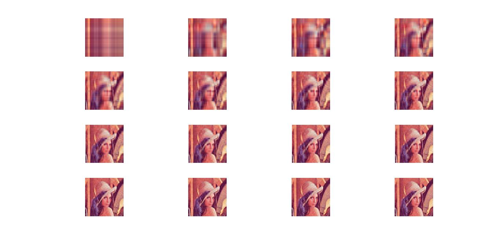

# quaternion_svd
QSVD, based on Le Bihan and Mars' paper.

This method decomposes this classic image into a quaternion version of U*S*V':

So, the resulting decomposition allows reconstruction using a percentage of the singular values:

